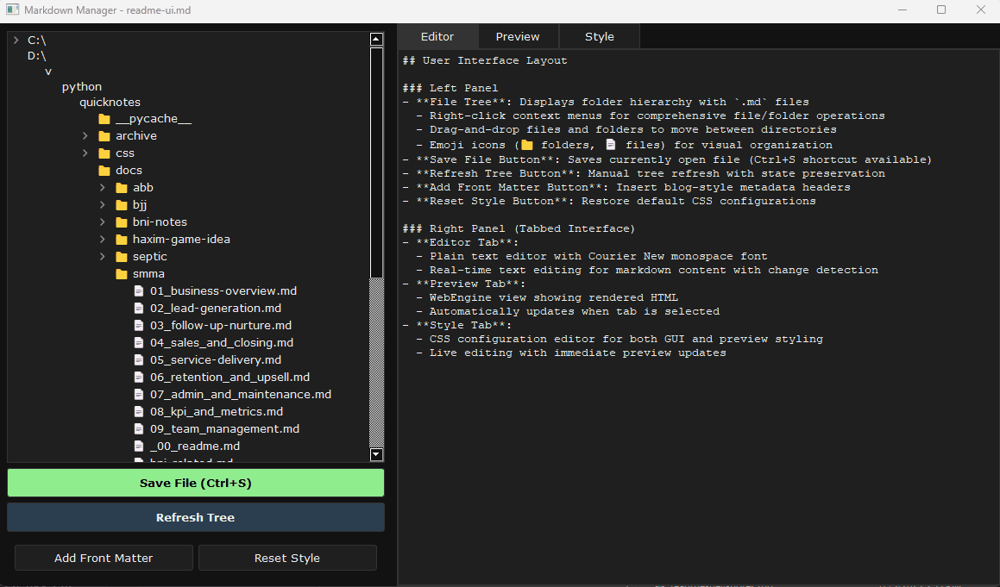

# Markdown Manager

A sophisticated, cross-platform markdown editor and file manager built with PyQt5, featuring hierarchical file organization, live preview, drag-and-drop operations, and extensive customization capabilities.

---

## Application Preview



---

## Features

### Core Functionality
- **Hierarchical File Explorer**: Tree-view interface displaying folders and `.md` files with lazy loading for performance
- **Dual-Pane Interface**: 
  - Left panel: File tree with context-sensitive operations and action buttons
  - Right panel: Tabbed interface with Editor, Preview, and Style tabs
- **Live Markdown Rendering**: Real-time HTML preview with custom CSS styling
- **Auto-Save Detection**: Visual indicators for unsaved changes with keyboard shortcuts (Ctrl+S)
- **Intelligent File Management**: Full CRUD operations with safety validation

### Advanced File Operations
- **Drag & Drop Operations**: Move files and folders with intelligent validation and cross-drive support
- **Cross-Drive Compatibility**: Handles file operations across different drives with integrity verification
- **Context Menus**: Right-click operations for creating, renaming, and deleting files/folders
- **Smart Filename Sanitization**: Automatic cleanup of invalid characters with user confirmation
- **Selective Tree Refresh**: Efficient updates that preserve expanded state and selection
- **Lazy Loading**: Performance-optimized tree expansion with on-demand content loading

### Safety & Security Features
- **File Integrity Verification**: MD5 checksums for cross-drive operations with progress tracking
- **Permission Checking**: Validates read/write permissions before operations
- **Input Sanitization**: Prevents invalid filenames and path injection attacks
- **Confirmation Dialogs**: User confirmation for destructive operations with risk assessment
- **Error Handling**: Comprehensive exception handling with user-friendly messages
- **Reserved Name Protection**: Prevents creation of system-reserved filenames

### Customization & Styling
- **Dual Theme System**: Separate customizable CSS for both GUI and preview rendering
- **Style Editor**: Built-in CSS editor with live preview updates and configuration management
- **Front Matter Support**: Template-based front matter insertion with automatic date stamping
- **Persistent Configuration**: Saves user preferences and style configurations across sessions
- **Reset Functionality**: Easy restoration to default themes and configurations

### Cross-Platform Support
- **Windows Drive Detection**: Automatic discovery and display of available drives with full navigation
- **Unix Filesystem Support**: Complete path navigation from root directory
- **Platform-Specific Optimizations**: Adapted file operations and UI elements for different operating systems
- **Universal Keyboard Shortcuts**: Consistent hotkey support across platforms

### User Interface Enhancements
- **Visual Feedback Systems**: Color-coded save states, progress indicators, and status updates
- **Expandable Interface**: Collapsible splitter with minimum size constraints
- **Icon-Enhanced Tree**: Emoji-based file type indicators for better visual organization
- **Tab-Based Workflow**: Seamless switching between editing, preview, and styling modes

---

## Project Structure
| File | Purpose | Key Features |
|------|---------|--------------|
| `app.py` | Application entry point | GUI styling application, configuration initialization |
| `gui.py` | Main UI logic and event handling | Tree management, file operations, tab handling, drag-and-drop |
| `file_manager.py` | File and folder operations | CRUD operations, integrity verification, cross-drive handling |
| `render.py` | Markdown-to-HTML conversion | CSS management, error handling, fallback systems |
| `config.py` | Configuration management | Style templates, front matter, default settings |
| `utils.py` | UI utilities and dialogs | Input validation, confirmation dialogs, progress tracking |
| `gui.tpl` | GUI styling template | Dark theme CSS for application interface |
| `preview.tpl` | Preview styling template | Markdown rendering styles with syntax highlighting |
| `fallback.css` | Emergency CSS fallback | Minimal styling for error conditions |
| `requirements.txt` | Python dependencies | PyQt5, markdown, and other required packages |
| `start.bat` | Windows launch script | Virtual environment activation and startup |
| `data.json` | Example data structure | Sample curriculum/content organization |
---


## Key Functionality

- **File Management**: Direct file system operations without database dependency
- **Drag-and-Drop**: Move `.md` files between folders in the tree view
- **Live Preview**: Automatic markdown rendering with tab switching
- **Error Handling**: Comprehensive validation and user feedback for all operations
- **Theme Support**: Consistent dark theme across all UI components

---


### Front Matter Templates
Customizable front matter with automatic date insertion:
```yaml
---
title: "Your Title Here"
date: 2025-07-15
draft: false
tags: []
categories: []
description: "Brief description"
---
```

---

## Installation & Setup

### Prerequisites
- Python 3.7 or higher
- PyQt5 with WebEngine support

