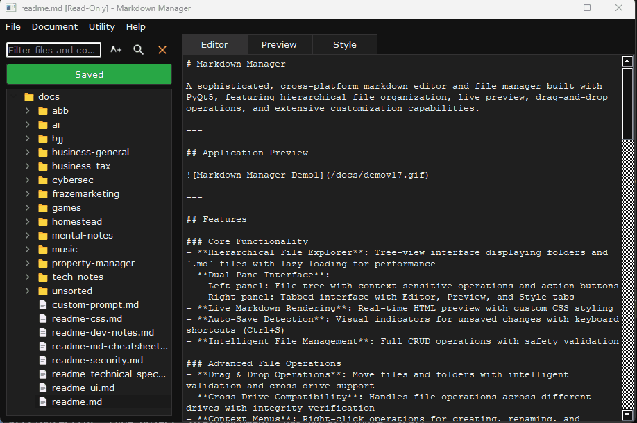

# Markdown Manager

A sophisticated, cross-platform markdown editor and file manager built with PyQt5, featuring hierarchical file organization, live preview, drag-and-drop operations, and extensive customization capabilities.

---

## Application Preview



---

## Features

### Core Functionality
- **Hierarchical File Explorer**: Tree-view interface displaying folders and `.md` files with lazy loading for performance
- **Dual-Pane Interface**: 
  - Left panel: File tree with context-sensitive operations and action buttons
  - Right panel: Tabbed interface with Editor, Preview, and Style tabs
- **Live Markdown Rendering**: Real-time HTML preview with custom CSS styling
- **Auto-Save Detection**: Visual indicators for unsaved changes with keyboard shortcuts (Ctrl+S)
- **Intelligent File Management**: Full CRUD operations with safety validation

### Advanced File Operations
- **Drag & Drop Operations**: Move files and folders with intelligent validation and cross-drive support
- **Cross-Drive Compatibility**: Handles file operations across different drives with integrity verification
- **Context Menus**: Right-click operations for creating, renaming, and deleting files/folders
- **Smart Filename Sanitization**: Automatic cleanup of invalid characters with user confirmation
- **Selective Tree Refresh**: Efficient updates that preserve expanded state and selection
- **Lazy Loading**: Performance-optimized tree expansion with on-demand content loading

### Images
- **Paste images** - saves to relative root/images folder

### Front Matter Templates

Customizable front matter with automatic date insertion as I intended to use it to also edit hugo sites.

```yaml
---
title: "Your Title Here"
date: 2025-07-15
draft: false
tags: []
categories: []
description: "Brief description"
---
```


### Safety & Security Features
- TODO: **File Integrity Verification**: MD5 checksums for cross-drive operations with progress tracking
- **Permission Checking**: Validates read/write permissions before operations
- **Input Sanitization**: Prevents invalid filenames and path injection attacks
- **Confirmation Dialogs**: User confirmation for destructive operations with risk assessment
- **Error Handling**: Comprehensive exception handling with user-friendly messages
- **Reserved Name Protection**: Prevents creation of system-reserved filenames

### Customization & Styling
- **Dual Theme System**: Separate customizable CSS for both GUI and preview rendering
- **Style Editor**: Built-in CSS editor with live preview updates and configuration management
- **Front Matter Support**: Template-based front matter insertion with automatic date stamping
- **Persistent Configuration**: Saves user preferences and style configurations across sessions
- **Reset Functionality**: Easy restoration to default themes and configurations

### Cross-Platform Support
- TODO: **Windows Drive Detection**: Automatic discovery and display of available drives with full navigation
- TODO: **Unix Filesystem Support**: Complete path navigation from root directory
- TODO: **Platform-Specific Optimizations**: Adapted file operations and UI elements for different operating systems
- **Universal Keyboard Shortcuts**: Consistent hotkey support across platforms

### User Interface Enhancements
- **Visual Feedback Systems**: Color-coded save states, progress indicators, and status updates
- **Expandable Interface**: Collapsible splitter with minimum size constraints
- **Icon-Enhanced Tree**: Emoji-based file type indicators for better visual organization
- **Tab-Based Workflow**: Seamless switching between editing, preview, and styling modes

---
## File Structure

```
markdown-manager/
├── css/
│   └── user/
│       ├── gui.css               (Generated by app)
│       ├── preview.css           (Generated by app)
│       └── print.css             (Generated by app)
├── docs/
│   └── (Your .md files and subfolders go here)
├── images/
│   └── (Pasted images are saved here)
├── templates/
│   ├── error.tpl
│   ├── fallback_preview.tpl
│   ├── gui.tpl
│   ├── preview.tpl
│   ├── print.tpl
│   ├── print_svg_support.tpl
│   └── svg_support.tpl
├── .gitignore
├── app.py
├── assets.py
├── clipboard_handler.py
├── config.py
├── data.json
├── file_manager.py
├── gui.py
├── readme.md
├── render.py
├── requirements.txt
├── start.bat
└── utils.py
```

## File Summaries

The very basics of what each file does, though this needs to be refactored a bit.

| File | Purpose | Key Features |
|------|---------|--------------|
| `app.py` | Application entry point | GUI styling application, configuration initialization |
| `clipboard_handler.py` | handles clipboard copy/paste | all images in root/images and renders preview.  Produces md code for you |
| `gui.py` | Main UI logic and event handling | Tree management, file operations, tab handling, drag-and-drop |
| `file_manager.py` | File and folder operations | CRUD operations, integrity verification, cross-drive handling |
| `render.py` | Markdown-to-HTML conversion | CSS management, error handling, fallback systems |
| `config.py` | Configuration management | Style templates, front matter, default settings |
| `utils.py` | UI utilities and dialogs | Input validation, confirmation dialogs, progress tracking |
| `requirements.txt` | Python dependencies | PyQt5, markdown, and other required packages |
| `start.bat` | Windows launch script | Virtual environment activation and startup |
---

## Template Files

The `templates/` directory contains the default stylesheets for all parts of the application. These are used to generate the user-configurable `.css` files on first launch.

These are not edited, but separate code to help keep the script less cluttered.   Actual working files are created in the css/* location.

| Template File | Purpose | Description |
|---|---|---|
| `gui.tpl` | **GUI Styling** | The default dark theme for the main application interface, including buttons, text boxes, and the file tree. |
| `preview.tpl` | **Preview Styling** | Default styles for the rendered markdown preview, including typography, code blocks, tables, and syntax highlighting. |
| `print.tpl` | **Print Styling** | A print-optimized stylesheet for the "Print Preview" feature, designed for clean output on white paper. |
| `error.tpl` | **Error Page Styling** | Styles for the error page that appears in the preview pane if the markdown fails to render correctly. |
| `svg_support.tpl` | **SVG Preview Support** | Contains CSS rules to ensure SVG images render correctly and responsively within the live preview pane. |
| `print_svg_support.tpl` | **SVG Print Support** | Additional CSS rules for rendering SVGs in the print-optimized HTML output. |
| `fallback_preview.tpl` | **Fallback CSS** | A minimal, emergency stylesheet for the preview pane that is used if the primary user styles fail to load. |


---

## Installation & Setup

### Prerequisites
- Python 3.7 or higher
- PyQt5 with WebEngine support

### Setup Instructions

1. **Clone the Repository**
   - `git clone https://github.com/rubysash/markdown-notes.git`

2. **Create Virtual Environment**
   - `python -m venv markdown-notes`
   - `cd markdown-notes`

3. **Activate Virtual Environment**
   - On Windows:
     - `Scripts\activate`
   - On Linux/macOS:
     - `source bin/activate`

4. **Install Required Packages**
   - `python -m pip install -r requirements.txt`

5. **Run the Application**
   - `python app.py`

## To Do

- make nix friendly (libraries and file paths not correct currently)
- Code refactor, clean up, make DRY
- Separate out gui into multiple files
- Clean up documentation to match final project/goals
- Config tab to default open doc folder, save image folder, etc
- Word count in gui to assist with writing blog/specific count articles
- git up or repo sync for backups
- more context menus and hot keys depending on work flow
- remove/consolidate css/templates vs multiple locations
- small task tracker that reminds on specific notes
- Test on Pi/Debian


